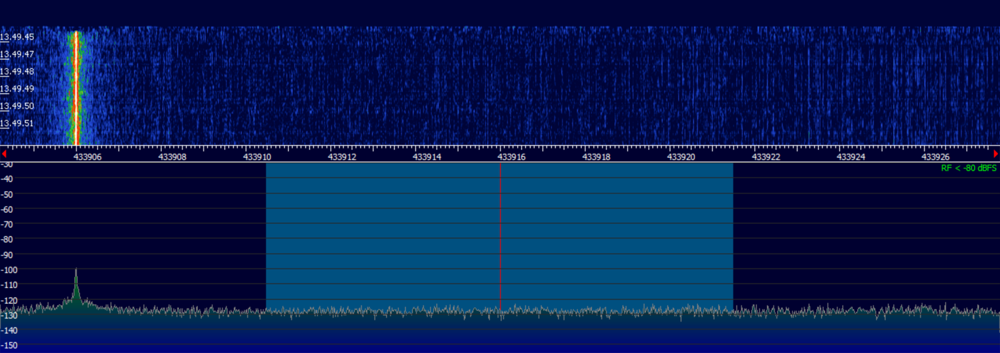
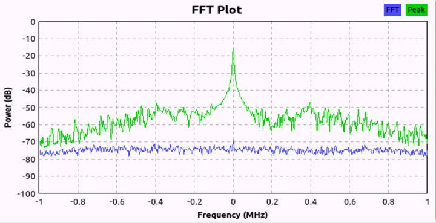

# How I Reverse Engineered These RF Protocols

This is how I figured out the RF protocols for the Gazco fireplace and Sonte smart film remotes. The process was pretty much the same for both projects - just different frequencies and encoding schemes.

**Note**: The screenshots here are from the Sonte project (February 2019) because I actually remembered to document that one properly. The Gazco project was earlier (2017-2018) and I didn't take as many screenshots, but the process was identical.

## What You Need

### Hardware
- RTL-SDR dongle (cheap ~$25 SDR receiver)
- YARD Stick One or similar RfCat device (for transmitting)
- The remote control you want to clone

### Software
- SDR# or HDSDR - for finding the frequency
- GNU Radio - for processing signals (though I mostly used Audacity)
- Audacity - surprisingly useful for analyzing RF signals as audio
- Python - for writing the actual control scripts

## The Process

### Step 1: Find the Frequency

First thing is figuring out what frequency the remote transmits on. Most consumer remotes use the 433 MHz ISM band since it doesn't require a license.

1. Fire up SDR# and tune to around 433 MHz
2. Set the waterfall display running
3. Press a button on the remote
4. Watch for spikes in the waterfall



You'll see vertical lines appear when you press the button. The Sonte remote was at 433.916 MHz. Once you see consistent signals at the same frequency, you've got it.

The signal repeats multiple times per button press - that's normal. These cheap remotes send the same command 5-10 times to make sure it gets through.

### Step 2: Capture the Signal

Now that you know the frequency, you need to actually record the signal.

1. Tune SDR# or HDSDR to the exact frequency
2. Set it to AM demodulation (since these use ASK/OOK modulation)
3. Hit record and press the button a bunch of times
4. Save the recording as a WAV file


I used a 320 kHz sample rate which gives good timing resolution. Higher is better but makes bigger files.

### Step 3: Figure Out the Encoding (This is the Fun Part)

Here's where Audacity comes in handy. Yeah, it's an audio editor, but RF signals demodulated to audio are just... audio.

Import the WAV file into Audacity and zoom way in on the pulses:


You'll see a pattern of high and low pulses. These aren't random - they encode the actual data.

For both my projects, they used PWM encoding where different pulse patterns represent 1s and 0s:

**Gazco fireplace:**
- Binary 1 = `100` (short high, long low)
- Binary 0 = `110` (medium high, short low)

**Sonte smart film:**
- Binary 1 = `1000` (high for 4 units)
- Binary 0 = `1110` (high for 3, low for 1)

I literally just counted samples in Audacity to figure this out. It's tedious but works.

There are other common encoding schemes you might see:
- **Manchester encoding**: 1='10', 0='01' (used in Ethernet)
- **Simple short/long**: 1=short pulse, 0=long pulse (common in cheap 433 MHz remotes)

But both my remotes used custom PWM patterns.

**How to calculate baud rate:**
```python
sample_rate = 320000  # Hz (your WAV file sample rate)
shortest_pulse = 292  # samples (count in Audacity)
baud_rate = sample_rate / shortest_pulse
# Result: ~1095 Hz per symbol
```

This is how I figured out the Gazco used 1095 Hz instead of the 3100 Hz I initially thought.

### Step 4: Extract the Binary

Once you know the encoding scheme, you can work backwards from the PWM to get the actual binary data.


I wrote Python scripts to parse the timing, but honestly for the first pass I just did it by hand.

**Example from my Gazco analysis:**
```
UP Button:
  Binary:  10000011101110010000100
  Length:  23 bits
  Repeats: 10 times per button press

Converting to PWM (1='100', 0='110'):
  PWM: 100110110110110110100100100110100100100110110100110110110110100110110
```

I tried to figure out the command structure - looked like there might be a preamble, address, and command sections:
```
  Possible structure:
    Preamble:   1000001 (7 bits)
    ID/Address: 1101110010 (10 bits)
    Command:    000100 (6 bits)
```

But honestly, I never confirmed if that's actually how it works. I just recorded each button's full pattern and hardcoded them.

**Sonte was simpler:**
```
Button 1: 1111111110111011111100111 (25 bits)
Button 2: 111111110111011111111101 (24 bits)
```

Just two different codes, no need to decode the structure.

### Step 5: Validate Everything

Before trying to transmit, I wanted to make sure I had the frequency right.



FFT analysis in GNU Radio confirmed 433.916 MHz with about 5 kHz bandwidth, which matches the 2500 Hz baud rate (rule of thumb: bandwidth ≈ 2× baud rate).

### Step 6: Build the Transmitter

Now for the actual fun part - making it work!

I used RfCat on a YARD Stick One. Basic Python script:

```python
import rflib

d = rflib.RfCat()
d.setFreq(433916000)              # Frequency in Hz
d.setMdmModulation(rflib.MOD_ASK_OOK)  # On-off keying
d.setMdmDRate(2500)               # Baud rate
d.makePktFLEN(15)                 # Packet length in bytes
d.setMaxPower()

# Send the command (pre-computed byte string)
d.RFxmit(b'\x88\x88\x88\x88\xe8...')  # PWM-encoded data
d.setModeIDLE()
```

The tricky part was converting my binary patterns into the correct byte strings. I ended up just capturing what each button should transmit and hardcoding it.

First time I hit run and the film actually moved was pretty satisfying.

## Things That Went Wrong

**Noisy captures**: I was too far from the remote at first. Moved closer and it cleaned up.

**Wrong baud rate**: Initially calculated 3100 Hz for Gazco but it should've been 1095 Hz. Had to go back to my original buttons.txt file to check.

**Timing issues**: RfCat timing isn't perfect. Had to send each command multiple times (repeat 5-10 times) just like the original remote does.

**Button confusion**: For Sonte, I initially thought there were up/down/stop buttons. Nope - just 2 buttons, one for transparent and one for opaque. Fixed this in 2024 when cleaning up the repo.

## Tips if You Try This

- Take screenshots as you go (I didn't for Gazco and regretted it)
- Capture each button press 10+ times and compare them
- Start with the simplest commands first
- The PWM encoding is usually the hardest part to figure out
- Don't trust your first baud rate calculation - verify it multiple ways
- Keep your raw capture files - you'll probably need to analyze them again

## Legal Stuff

Obviously only do this with your own devices. These are my fireplace and smart film controller that I own. RF regulations vary by country but in the US these 433 MHz remotes fall under FCC Part 15 (unlicensed operation) so cloning your own remote is fine.

## Timeline

**Gazco Project** (2017-2018):
- Figured this out over a few weeks
- Didn't document it well
- Lost some of my original analysis files

**Sonte Project** (February 2019):
- Did it in an afternoon having learned from Gazco
- Actually took screenshots this time
- Much better documentation

The second time was way faster because I knew what I was doing.

## Tools I Actually Used

- **SDR#**: Free, works fine for frequency discovery
- **HDSDR**: I used this more than GNU Radio honestly
- **Audacity**: Seriously underrated for RF work
- **Python + numpy**: For the actual implementation
- **RfCat**: The YARD Stick One is expensive (~$100) but worth it

## Conclusion

Reverse engineering RF protocols isn't as hard as it sounds. These consumer remotes use pretty simple protocols - no encryption, no rolling codes, just basic PWM encoding. The hard part is patience with the timing analysis.

Once you've done it once, the second time is much easier because you know what to look for.
